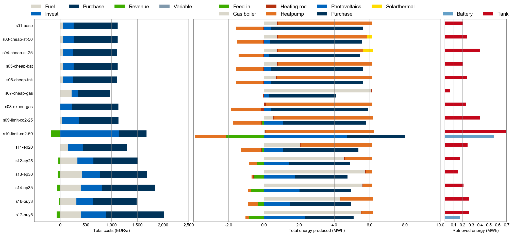
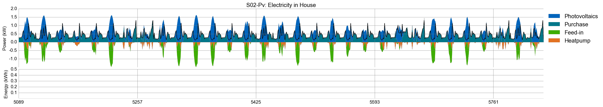
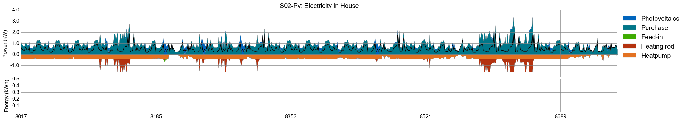
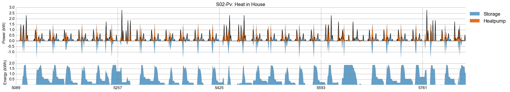

# urbs - 1house example

*For installation instructions, please refer to the master branch in the main model repository [**tum-ens/urbs**](https://github.com/tum-ens/urbs).*

This branch contains a small example study with one site, custom run script and a comparison script. It employs two scenario generator functions to create a cost and performance parameter study for the relevant technologies.

## Plots

### Comparison

### Plot: electricity

### Plot: heat

## Background

> *Note: italic words refer to sheet names or column labels in the input file `1house.xlsx`*

The study object is an exemplary house which has to satisfy its hourly demand for electricity (4047 kWh/a, 462 W average load) and heat (6115 kWh/a, 698 W average load). It can choose to install and operate any subset from a suite of common technologies and energy sources. 

For **electricity**, on-roof photovoltaics can be installed. Its hourly yield is determined by a pre-specified time series of so-called capacity factors (sheet *SupIm*). Other than that, a time-variable priced supply from the electricity grid can be purchased. Surplus electricity can be sold back to the grid, but generally the revenue is lower than the purchase price.

For **heat**, a standard gas boiler is the most commonly available technology for relatively low investment (sheet *Process*, row *Gas boiler*, column *inv-cost*) and low operating costs (sheet *Commodity*, row *Gas*, column *price*). Alternatives are a heating rod (efficiency 1.0) and a more expensive heat pump (coefficient of performance 3.5), both using electricity as their input. The last option is to install solarthermal panel on the house roof.
